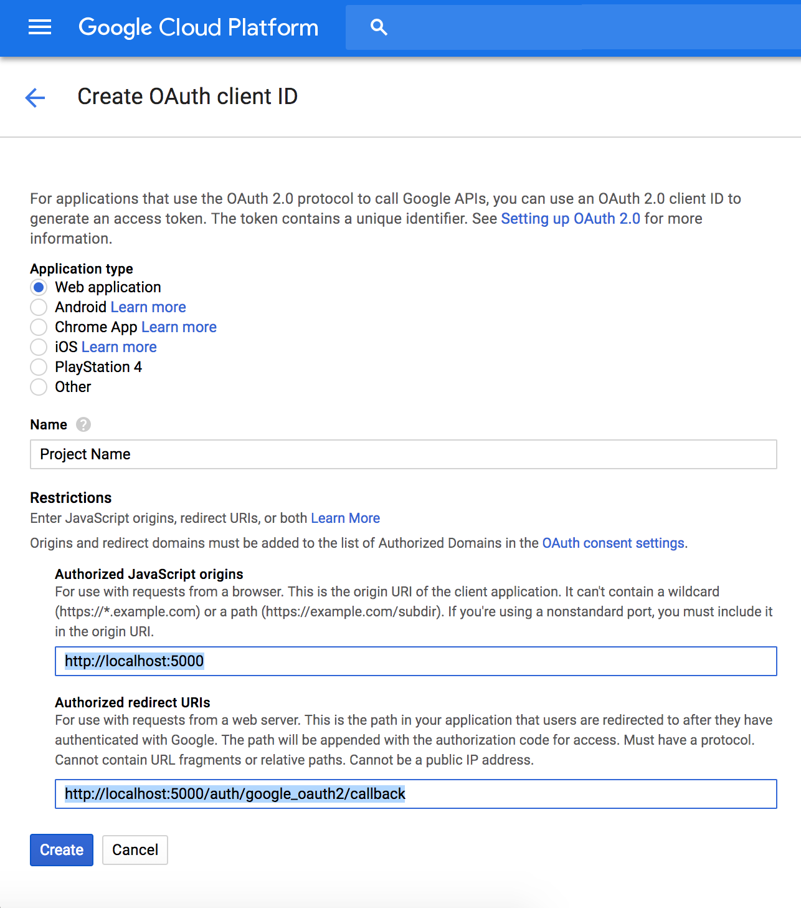

# Development

## Set up your Environment

1. Clone the project

   ```bash
   git clone git@github.com:zendesk/volunteer_portal.git
   cd volunteer_portal
   ```

1. Install the right version of ruby and node

   ```bash
   rbenv install
   nvm install
   ```

1. Install dependencies

   ```bash
   gem install bundler
   bundle install
   npm install
   ```

   `bundle install` might stop, prompting you to manually `gem install pg`. To proceed, do `brew install postgresql` first, followed by `gem install pg`, before continuing with `bundle install`.

1. Install PostgreSQL

   The easiest thing is probably to use their app. http://postgresapp.com/

1. Create the `volunteer` database role

   ```bash
   psql -c 'CREATE ROLE volunteer WITH LOGIN SUPERUSER'
   ```

1. Copy the `.env.development.example` file to `.env.development`

   ```bash
   cp .env.development.example .env.development
   ```

## Set up Google OAuth

Use the following links or if they've fallen out of date then Google's [Setting
up OAuth 2.0 page](https://support.google.com/cloud/answer/6158849?hl=en) should
guide you through the process.

1. Make sure you have an account that has permissions to create projects. You
   may need to create a new google account. Make sure you're logged in as this
   account for all following steps.
1. [Create a project](https://console.cloud.google.com/projectcreate)
1. Create *OAuth client ID* on the [Create credentials
   page](https://console.cloud.google.com/apis/credentials). You may be told
   you need to set a project name for the consent screen, follow that link. When
   creating OAuth client ID:
   * Under Applicationm, select `Web Application`
   * Under Restrictions, fill the fields accordingly,
    - `http://localhost:5000` for *Authorized JavaScript origins*, and,
    - `http://localhost:5000/auth/google_oauth2/callback` for *Authorized redirect URIs*
    <space><space>
    
    <space><space>
   * Hold onto the *client ID* and *client secret*, as you will need to key this into
   the `.env.development`, respectively as `GOOGLE_CLIENT_ID` and `GOOGLE_CLIENT_SECRET`, later.

1. Create *Service Account Key* on the [Create credentials
   page](https://console.cloud.google.com/apis/credentials).
   * You'll likely have to create a new service account. I just entered in a
     random name and `Project > Owner` as the role.
   * Select JSON as the key type.
   * A JSON file will be downloaded. Hold onto the `private_key_id` and `private_key`, as you will
   need to key this into the `.env.development`, respectively as `GOOGLE_PRIVATE_KEY_ID` and `GOOGLE_PRIVATE_KEY`, later.

1. Now that you have your *OAuth client ID* and *Service Account Key* set up, time to
   include this as your environment variables. Open `.env.development` file and insert the values as below. You should not be updating `.env.development.example`. Read _step 6_ in *Set up your Environment*.
   ```
     HOST=http://localhost:5000
     PUBLIC_ASSET_HOST=localhost
     DATABASE_URL=postgres://volunteer@localhost/volunteer_development
     ATTR_ENCRYPTION_KEY=aaaaaaaaaaaaaaaaaaaaaaaaaaaaaaaa
     GOOGLE_CLIENT_ID=your_OAuth_Client_ID
     GOOGLE_CLIENT_SECRET=your_OAuth_Client_Secret
     GOOGLE_PRIVATE_KEY_ID=your_service_account_key
     GOOGLE_PRIVATE_KEY=your_service_account_key

   ```
1. [Enable the Google+ API](https://console.developers.google.com/apis/library/plus.googleapis.com/)

## Start the App

Make sure that PostgreSQL is running.

Create the database by running the command line below. You should only need to do this once.

 ```
 ./bin/rails db:setup
 ```


To start the app and run it locally, run the command line blow. `foreman` is used to run both the rails server and the webpack dev server in development.

```
bundle exec foreman start
```

The server runs on [localhost:5000](http://localhost:5000/) by default.

## Become an admin:

```bash
bundle exec rake 'volunteer:make_admin[your_email_address]'
```

## Running tests

Rails tests are provided via Minitest and frontend tests with Jest.

### Rails

To run backend tests:

```
bundle exec rake test
```

### Jest

To run frontend tests:

```
npm run test
```

lint-stage alongside Husky are used to ensure frontend tests are run on staged files via a precommit hook.

To manually run frontend tests on just staged files:

```
npm run precommit
```
